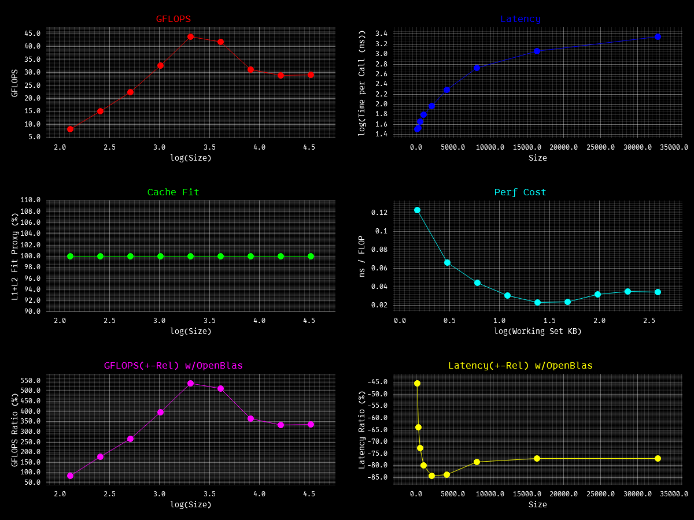
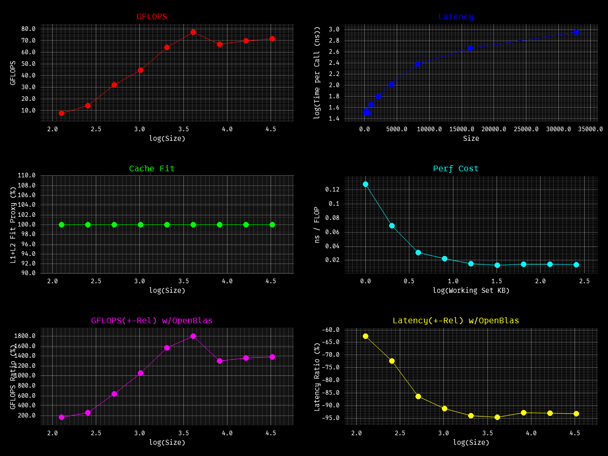
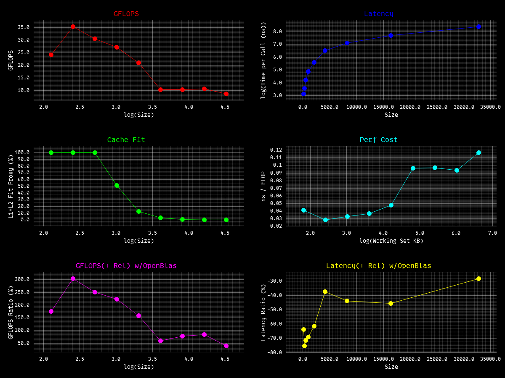
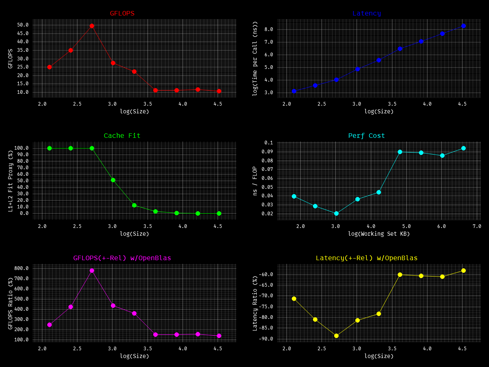

Rookie attempt to rewriting **BLAS FORTRAN 77 Prototype** Kernels in modern rust. `ONLY x86_64`

> This will not cover all kernels for every single BLAS routine, but the most commonly used ones, (excluding complex
> type) and I have **spammed** `_mm256_*` intrinsics for all kernels, because I got I7 14650hx which does not support
> AVX-512 :( and lastly, this project is purely for learning source, the code is well written & documented, and I will
> add .asm snippet [here](asm) for specific kernel & more refs for better understanding about rust compiler, x86, HPC,
> performance-optimization engineering.

refs I took:

- https://www.netlib.org/blas/ ← good for overview
- https://www.netlib.org/lapack/explore-html/ ←/
- https://icl.utk.edu/~mgates3/docs/lapack.html ←/
- https://www.intel.com/content/www/us/en/docs/onemkl/developer-reference-dpcpp/2025-2/blas-routines.html ← good
  details, very clear
- https://www.intel.com/content/www/us/en/docs/intrinsics-guide/index.html ← good man for intrinsics
- https://doc.rust-lang.org/core/arch/x86_64/index.html#functions ←/

TODO:

- lvl1: rotmg, rotm
- lvl2: all
- lvl3: all
- handle NaN, over/underflow, return vs panic and many more edge cases :(
- test code ref from [this](https://github.com/OpenMathLib/OpenBLAS/tree/develop) repo
- multithreading, GPU maybe?

run [bench](./bench/bencher.rs) using
`cargo run --bin bencher --release` [ref](https://github.com/OpenMathLib/OpenBLAS/tree/develop/benchmark)

> NOTE: need openBlas installed in system

- windows: clone [this](https://github.com/microsoft/vcpkg.git), run `.\bootstrap-vcpkg.bat`, then
  `.\vcpkg install openblas:x64-windows` and `setx VCPKG_ROOT=C:\path\to\vcpkg`
- linux: `sudo apt install libopenblas-dev pkg-config` or `sudo pacman -S openblas pkg-config`

all are single threaded!!! ran on i7 14650hx, rust 1.94.1

### axpy

### dot

### gemv

### gemv_t

